# Simran QC Platform — Client Guide to the Flow & Features

**Prepared for:** Management & Quality team, Simran Technocrats (I) Pvt. Ltd., Dombivali MIDC
**Prepared by:** Skyrn Studio
**Companion documents:** `docs/DEMO_RUNBOOK.md` (what to click, beat by beat) · `docs/project/client-proposal.md` (business case) · `docs/project/pricing-roi-analysis.md` (pricing & ROI)

> **Illustrated:** every screenshot below is captured from the running platform with the exact data described — nothing is mocked up.

> **How to read this.** §2 tells the story of **one real lot** travelling through the platform, start to signed report — that is the "proper flow". §3 then explains **every feature** in the order a user meets it, each with the exact values you will see on screen. §5 answers "what does this save me?" with numbers. Everything in here matches the running software — you can verify every value live in the demo.

---

## 1. The platform in one paragraph

Simran Technocrats runs its dimensional and coating inspections on Excel. A forensic audit of your two controlled formats (**ST/QC/02** Dimensional, **ST/QC/04** Coating) found the spreadsheets carry compliance risks that could fail a FLENDER/WINERGY audit tomorrow: a recorded dew point **29.2 °C against steel at 28.8 °C** (painting on cold steel — an automatic ISO 12944-7 rejection), a template with **Nominal 10, Min 1, Max 3** (impossible limits, undetected), and an **Equipment ID column 100 % blank** across all 53 rows (zero instrument traceability under ISO 9001).

The platform digitizes both workflows **on top of your existing audited formats** — same layouts, same format numbers, same sign-off blocks — and makes these failure classes *physically impossible*: the maths runs at the point of capture, the server re-verifies every result, and every approval is dual-signed, MFA-gated and immutable.

---

## 2. The life of a lot — the proper flow, end to end

Follow one real lot through the system. Every value below is the actual demo data loaded in the platform.

### Stage 0 — The part exists before anyone measures it *(Admin, one time)*

In **Item Master**, the part is defined once:

| Field | Value |
|---|---|
| Item code | `W1G00005572` |
| Description | Spiral Air Duct Cap |
| Customer | FLENDER |
| Drawing | `9423E` rev `A` (released 15 Jan 2026) |
| Dimension template | **53 rows**, each with nominal ± tolerance — e.g. row DIM-08: **nominal 100.00, limits 99.50–100.50** |
| Coating spec | Carbon steel, blast **Sa 2.5**, profile 45–75 µm, system **C4 HIGH inside / C3 HIGH outside**, DFT nominal **240 µm** inside / **180 µm** outside |

Because the template lives in the database, **the inspector never types a nominal again** — and a hand-typed error like `Min 1 / Max 3` can never enter a live document. Templates are maintained by your admin through a form or paste-import; no developer is needed.

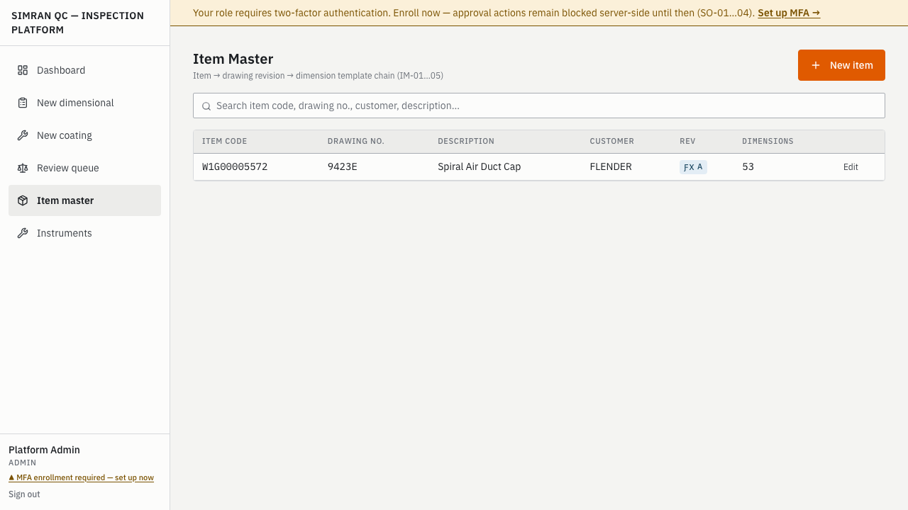
*Item Master — the part `W1G00005572` with its drawing `9423E` rev A and 53-row dimension template.*

### Stage 1 — The inspector opens a batch *(≈ 30 seconds)*

The inspector signs in (`inspector1@simran.local`), clicks **New dimensional**, picks `W1G00005572` from the recent-items list, and types the lot header:

| Field | Demo value |
|---|---|
| PO number | `PO-DEMO-2609` |
| Delivery batch | `2609-01` |
| Lot quantity | `120` |

One click on **Load Inspection Grid** and the **53-row grid** appears — Min/Nom/Max printed on every row, a toolbar showing **"0/53 rows complete"**, and a save indicator in the header.

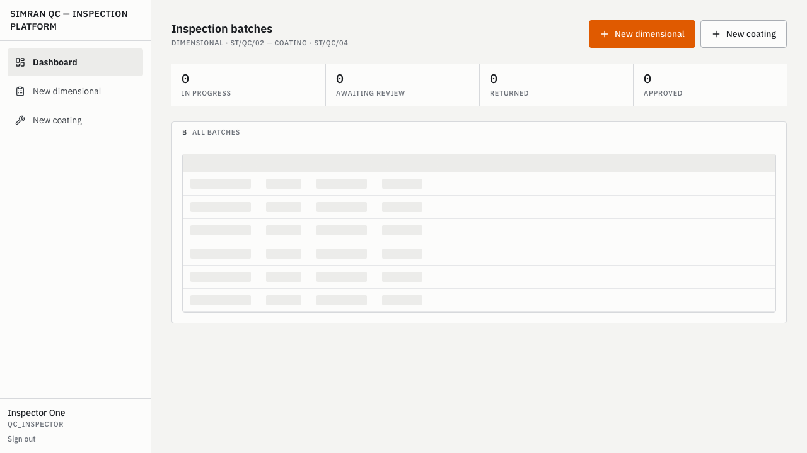
*The inspector's dashboard — KPI strip (in progress / awaiting review / returned / approved) and the two create actions.*

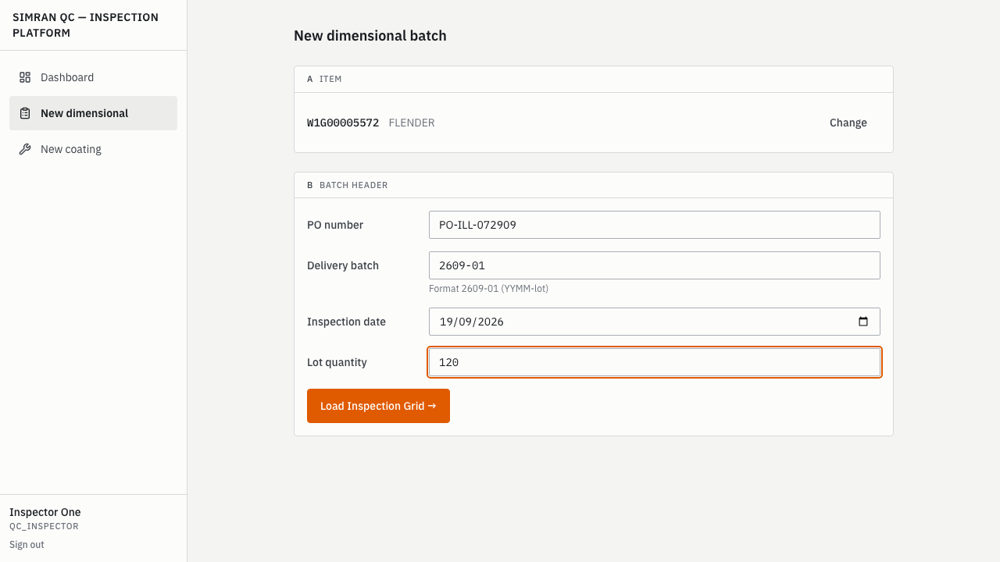
*Stage 1 — the lot header: PO `PO-DEMO-2609`, delivery batch `2609-01`, lot 120. The item is picked, not typed.*

### Stage 2 — Measurement, with the maths watching *(≈ 3–5 minutes — this is where the 35–45 minutes goes)*

The inspector types readings. The platform **grades each value the instant it is typed** and re-checks it again on the server at submit:

| Row DIM-08 entry (nominal 100.00, band 99.50–100.50) | Chip shown | Meaning |
|---|---|---|
| `100.00` | **PASS** (green) | inside the band |
| `100.45` | **NEAR** (amber) | inside, but within 0.10 of the limit — worth a second look |
| `100.60` | **FAIL** (red) | outside the band — caught **at the machine**, not at review |

Time-savers built into the grid:

- **Fill Nominal / Copy 01→05** — one click fills five samples for calibration-verified repeats.
- **Bulk instrument apply** — pick gauge **VC-04 (Mitutoyo 500-196-30)** once; all 53 rows are stamped. This single click kills your audit finding *"Equipment ID column 100 % blank."*
- **Keyboard-only flow** — the whole grid is operable without a mouse; a tablet is a first-class target.
- **Autosave** — the header shows "✓ saved Xs ago"; nothing is ever held only in someone's head.
- **Offline capture** — if the shop floor loses Wi-Fi mid-inspection (it happens), typing continues into local storage and syncs on reconnect. **Nothing is lost.** This is provable in the demo: switch the browser offline, type, reload — the value is still there.

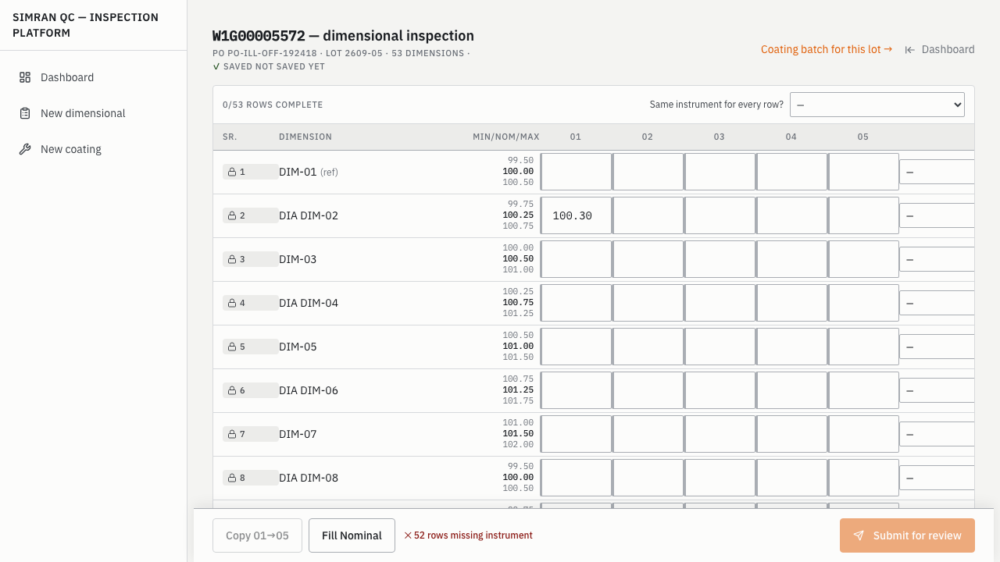
*Network cut mid-inspection: the header says so plainly — "OFFLINE — EDITS STAY ON THIS DEVICE" — and typing continues (row DIM-02 holds `100.30`).*

*Connection restored: the queue drains automatically and the indicator returns to "✓ saved" — nothing was lost during the blackspot.*

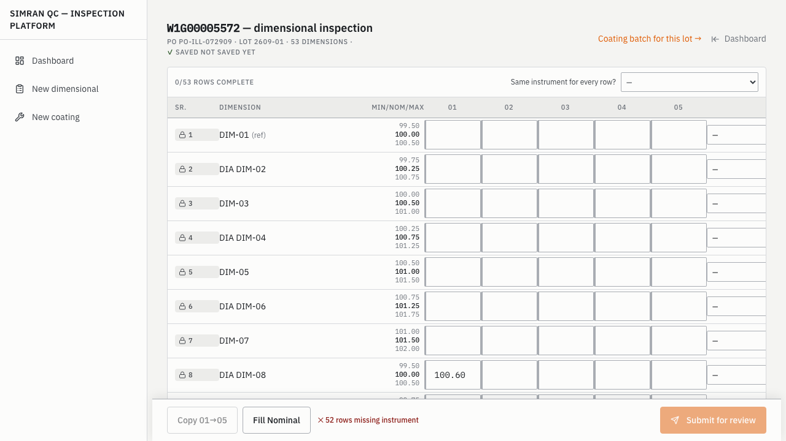
*Stage 2 — row DIM-08 sample 01 typed as `100.60`: the chip flips to FAIL at the machine, before the value can hide in a spreadsheet.*

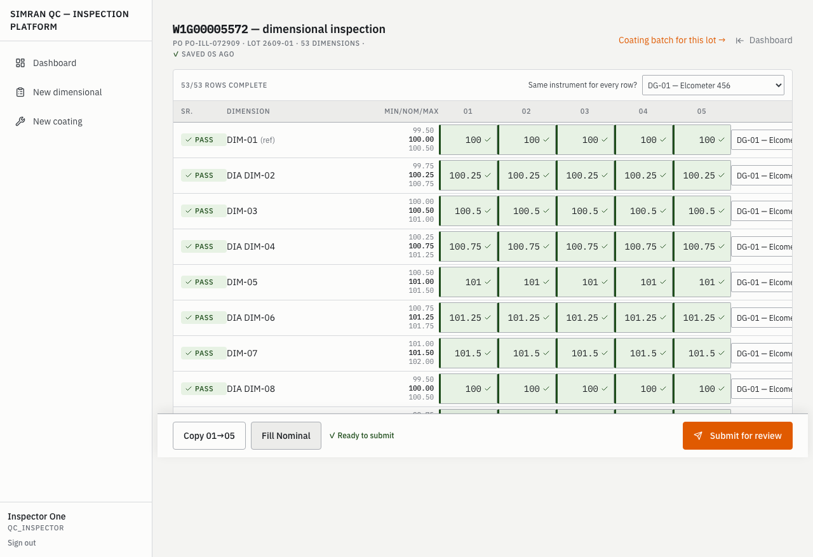
*All 53 rows complete, instrument VC-04 bulk-applied, checklist green — Submit for review is unlocked.*

When every row is complete and every instrument is in calibration, **Submit for review** unlocks. An incomplete or expired-instrument batch **cannot** be submitted — the checklist gate names exactly what is missing.

### Stage 3 — The coating record for the same lot *(linked, zero re-typing)*

From the dimensional batch, one click — **"Coating batch for this lot →"** — creates the coating record with the header **inherited** (same PO, same lot code, same item). This ends your audit finding that delivery batch codes drifted between stages (`2604-02` vs `2605-02`).

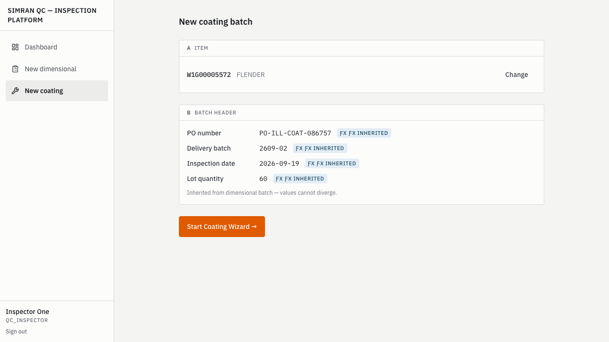
*Stage 3 — the hand-off screen: the header is marked INHERITED — zero re-typing, one lot identity across both records.*

The coating wizard has five sections, each with its own physical and standard-based enforcement:

- **A — Surface prep:** steel grade **IS 2062 Gr. B**, blast method **Airless Grit Blasting**, blast grade **Sa 2.5** (ISO 8501-1), grit size **G-40**, comparator grade **Medium (G)**, and all 3 pre-treatment checkmarks (welds P-2, solvent clean, water break test). Enter surface profile **60 µm** → live chip **PASS (45–75 µm)**. Test typing **35 µm** → chip flips to red **OUT OF RANGE (<45 µm)**. Assign profile gauge **DG-01**.
- **B — Psychrometrics (the dew point watchdog):** enter Ambient **25.0 °C**, RH **50 %**, Steel **30.0 °C** → the engine computes dew point **≈ 13.9 °C** and ΔT **≈ 16.1 °C** → **APPLICATION PERMITTED** (green). Now set RH to **90 %** (or Steel to **21.0 °C**) → the panel **locks**: ISO 12944 forbids painting above 85 % RH or below 3 °C above dew point, and the software physically refuses the sign-off. *This is the exact failure your audit found on paper (29.2 °C vs 28.8 °C). It cannot happen here.* Reset to safe conditions to proceed.
- **C — Coat log:** show the live build-up stack pills at top (Coat 1 / Coat 2 / Coat 3).
  - **Coat 1 (Primer):** Product **Interplus 256**, Part A **IPA-2609**, Part B **IPB-881**, mfg date **today**, Thinner **5 %**, WFT **110 / 115 / 110 µm** → average **112 µm** (green).
  - **Coat 2 (Intermediate):** Product **Intergard 475HS**, Part A **IGA-2609**, Part B **IGB-475**, mfg date **today**, Thinner **5 %**, WFT **160 / 165 / 160 µm** → average **162 µm** (green).
  - **Coat 3 (PU Finish):** Product **Interthane 990**, RAL **7035**, Part A batch + **mfg date today** → shelf-life green (**VALID**). Change mfg date to **2024-01-01** → **"Shelf life expired"** hard block (red) — expired material cannot be signed onto a lot. Reset to today. Record Thinner **10 %** and WFT **80 / 85 / 80 µm** → average **82 µm**.
- **D — DFT (ISO 19840 / SSPC-PA 2):** 26-point grids per side. Gauge **DG-01** carried over automatically from Section A. Nominal **240 µm** inside → the live panel shows **Mean / Min / Max / σ** and the ISO 19840 verdict. Type **150** at one point → below the 80 % floor (192 µm) → verdict flips to **FAIL**. Type **500** at one point → above the 200 % cap (480 µm) → flips to **FAIL**. Reset to **240** to restore **PASS**. No hidden "shadow cells" to break — the statistics engine lives in one audited place.
- **E — Visual checks:** structured 5-attribute defect capture (runs & sags, blistering, pinholes, orange peel, dry spray). Marking **Blisters = Fail** flips the counter to **4/5**, displays a defect alert, and lights up the **Draft NCR** path with pre-filled lot context. Reset to **Pass** to clear the gate.

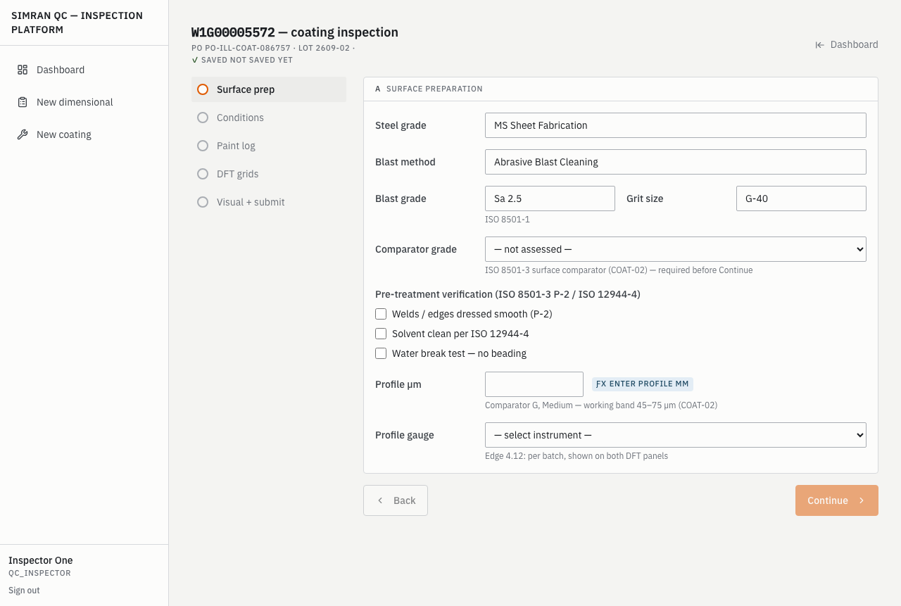
*Section A — surface preparation: comparator grade, blast Sa 2.5, profile with a live verdict chip, and the ISO 8501-3 pre-treatment checks.*

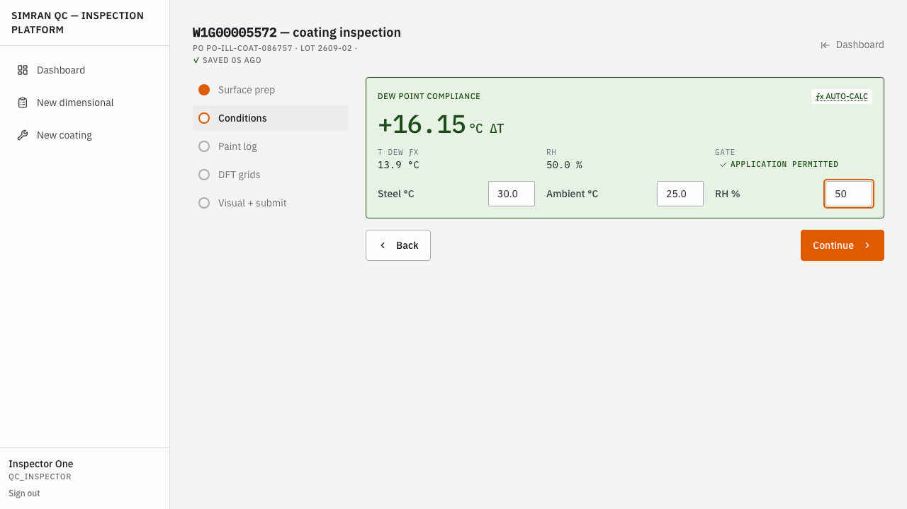
*Section B — safe conditions: ambient 25.0 °C, RH 50 %, steel 30.0 °C → dew point computed at ≈ 13.9 °C, ΔT ≈ 16.1 °C → APPLICATION PERMITTED.*

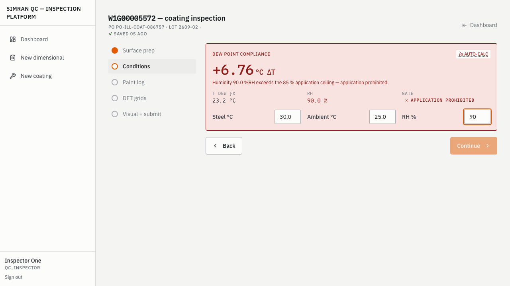
*RH raised to 90 % → APPLICATION PROHIBITED. The panel locks and Continue is disabled — this is the exact failure your audit found on paper, made impossible.*

### Stage 4 — Quality Head review — dual sign-off with teeth *(≈ 1–2 minutes)*

The batch now sits in the QH's **review queue** with flag counts (▲ warns / ✕ fails / expired instruments), so the QH **triages by exception** — clean batches take a minute, problem batches get the attention.

The QH signs in as `qh@simran.local` and is asked for a **6-digit TOTP code** from their authenticator app. This is not cosmetic: approvals are gated **server-side** at authentication level 2 — a stolen password alone cannot approve a lot.

Inside the record, the QH sees **exactly what the inspector submitted** — read-only, with flags anchored to the offending rows. Two control rules are enforced by the server, not the UI:

1. **Separation of duties** — the author of a batch is never offered Approve/Reject. They see their own record read-only.
2. **Immutability** — an approved batch is a permanent record; it cannot be edited afterwards.

**Approve & Sign** (or **Reject with a reason**, which lands back on the inspector's dashboard as a pinned comment explaining the "what and where").

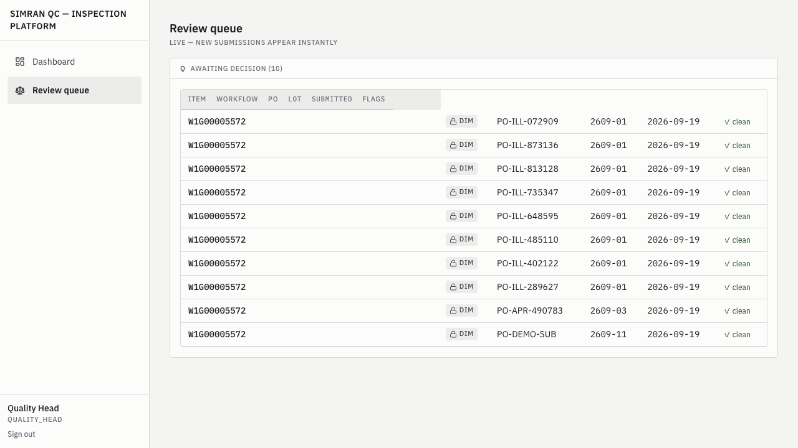
*Stage 4 — the Quality Head's review queue, live: every submission appears instantly with flag counts for triage by exception.*

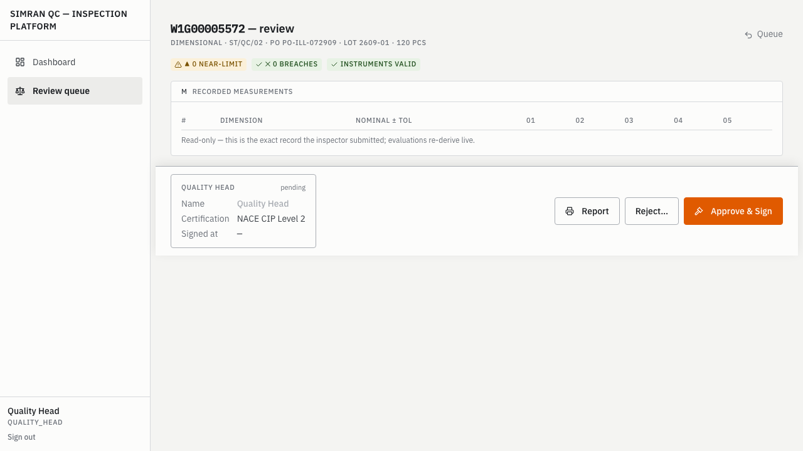
*The record exactly as submitted — read-only, with flag anchors and the decision bar. The author of a batch never sees these buttons.*

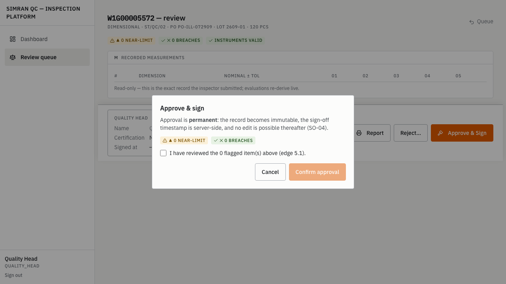
*Approve & Sign: the modal states that approval is permanent — the record becomes immutable and the sign-off timestamp is server-side.*

### Stage 5 — The audit-ready document *(one click)*

Approved batches offer their controlled report. **ST/QC/02** (dimensional) and **ST/QC/04** (coating) render in your plant's own format — same format numbers, revision blocks and sign-off blocks — with page numbers, a print guard, and an **export audit trail** (every print/email logged against the actor). The inspector can show it on screen, print it, or email it; the layout is locked so it cannot drift from the format your auditors have seen.

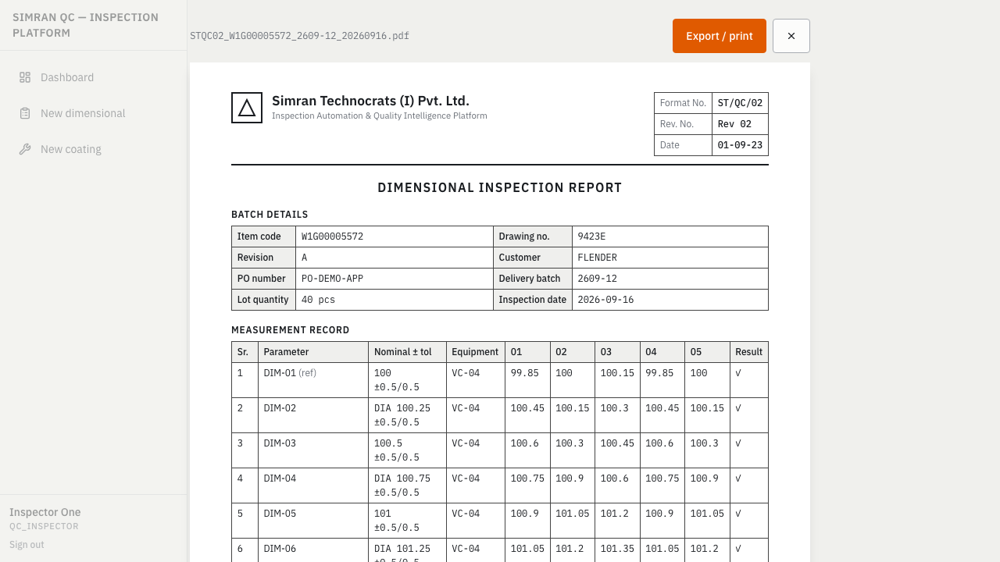
*Stage 5 — the controlled ST/QC/02 on screen: letterhead, format block (ST/QC/02 · Rev 02), and the full measurement record with per-row equipment codes.*

### Stage 6 — Answering the auditor *(seconds, not evenings)*

- **Instrument usage recall:** "Which lots did gauge VC-04 touch?" → Admin → Instruments → open **VC-04** → usage history + CSV export, in one click. If a gauge is later found out of calibration, you know **instantly** which records are affected — this is the ISO 9001 exposure your current blank Equipment ID column leaves completely open.
- **Calibration trail:** every gauge carries its calibration timeline; expired gauges are flagged **EXPIRED** at selection time, and readings taken on one carry a mandatory acknowledgement at review.
- **NCR register:** non-conformances captured at the moment of failure (DB-allocated numbers, e.g. **NCR-2609-001**), not reconstructed the week before the audit.
- **Everything is timestamped:** drafts, submissions, decisions, exports.

**Drafting an NCR the moment a FAIL happens:**

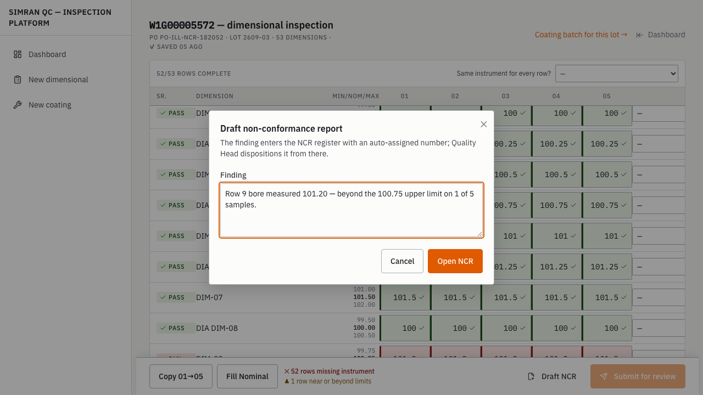
*Row 9 measured beyond tolerance on all five samples → the checklist flags "1 row near or beyond limits" → Draft NCR opens pre-filled with the finding; the register allocates the number (NCR-2609-001) server-side.*

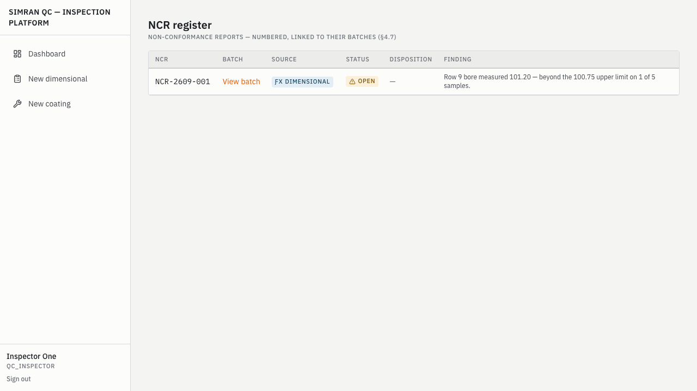
*The NCR register: numbered, linked to its batch, status-tracked (OPEN → ACKNOWLEDGED → CLOSED) with the QH's disposition recorded against it.*

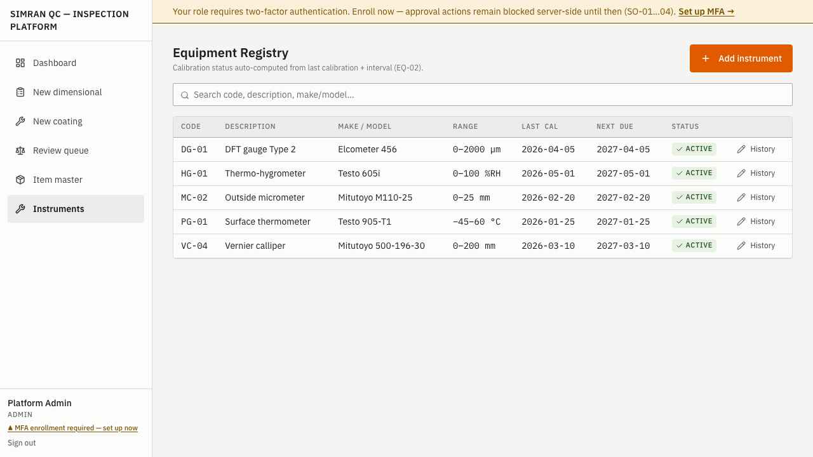
*Stage 6 — the Equipment Registry: calibration status auto-computed from last calibration + interval (EQ-02).*

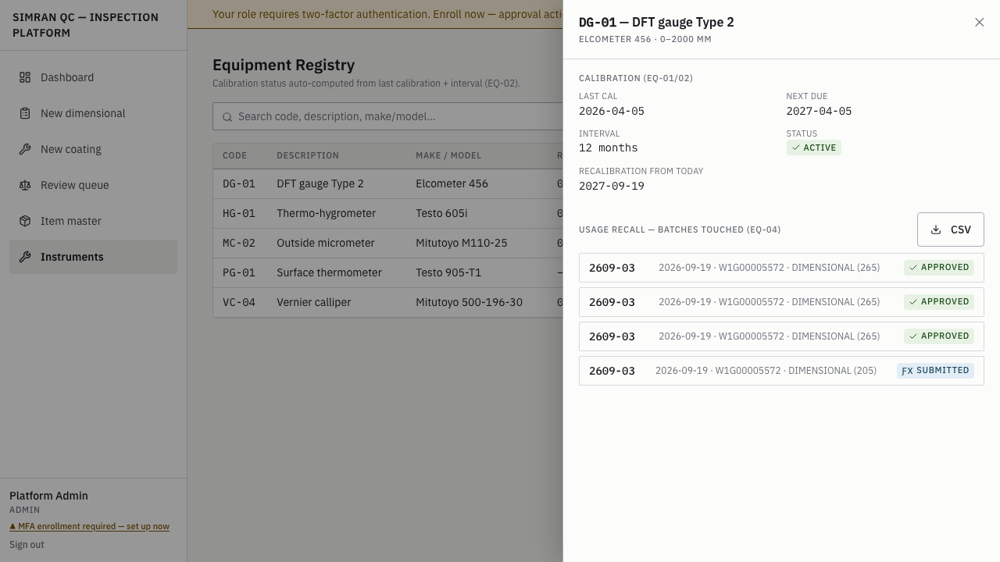
*The recall drawer for gauge DG-01: calibration identity on top, every batch the gauge touched below, CSV export in one click — "which lots did this gauge touch?" answered in seconds (EQ-04).*

---

## 3. Feature catalogue — what each thing is and why it matters

### Access & security

| # | Feature | What the client gets |
|---|---|---|
| 1 | **Provisioned accounts, one per role** | Nobody can self-register into a quality system. The administrator issues every account with exactly one role — QC Inspector, NACE Inspector, Quality Head, or Admin — and elevation is never self-service. |
| 2 | **TOTP MFA for QH/Admin** | Approvals demand a second factor, enforced server-side. A phished password cannot approve a batch. |
| 3 | **Session inactivity timeout** | A tablet left on the shop floor signs itself out — no open session walking around. |
| 4 | **Multi-tab conflict guard** | Two tabs on one batch → the second goes read-only. No silent last-write-wins overwrites. |

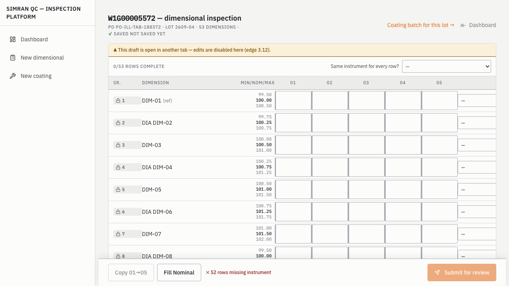
*The same draft opened in a second tab: the first tab locks with an explicit banner and its grid goes read-only — the edits in the other tab can never be silently overwritten.*

### The dimensional workflow (ST/QC/02)

| # | Feature | What the client gets |
|---|---|---|
| 5 | **Item Master templates** | Nominals, tolerances and symbols flow from the database — typed-formula errors (`Nominal 10 / Min 1 / Max 3`) are structurally impossible. |
| 6 | **53-row virtualised grid, 5 samples/row** | 265 data points per batch, smooth on a tablet, keyboard-first. |
| 7 | **Live pass/warn/fail colouring** | Errors are caught at the machine. The same engine re-runs server-side at submit — the client cannot fake a verdict. |
| 8 | **Min/Nom/Max on every row** | No paging to the drawing to know the band. |
| 9 | **Bulk instrument apply + progress counter** | 53 instrument picks collapse to one; "37/53 rows complete" is always visible. |
| 10 | **Autosave + honest save indicator** | "Saved 12 s ago" reflects the last *completed* write. No false reassurance. |
| 11 | **Offline capture + queue drain** | Blackspots don't stop work; drafts persist locally and replay on reconnect. |
| 12 | **Submission checklist gate** | Incomplete rows, missing instruments or expired gauges block submission — with the exact reason named. |
| 13 | **Rejected-batch pin with QH comments** | A rejected batch returns with the reason attached — no phone calls to find out why. |
| 14 | **Linked coating batch** | One lot, two records, zero header re-typing — stage-to-stage traceability restored. |

### The coating workflow (ST/QC/04)

| # | Feature | What the client gets |
|---|---|---|
| 15 | **Psychrometric engine + lock-out** | Dew point (Magnus–Tetens) and ΔT computed live; painting **locked** when RH > 85 % or ΔT < 3 °C. The audit's documented non-conformance becomes impossible. |
| 16 | **Per-coat log + build-up stack** | Full paint traceability — product, batch, RAL, coat sequence, WFT/DFT per coat. |
| 17 | **Shelf-life hard block** | Expired material cannot be signed onto a lot (COAT-04). |
| 18 | **26-point DFT engine, ISO 19840 verdict** | Mean/Min/Max/σ and the 80 %/200 % compliance verdict computed live — no hidden helper cells. |
| 19 | **Structured visual checks (n-of-5)** | Defects feed the NCR path instead of a free-text cell. |

### Review, records & audit

| # | Feature | What the client gets |
|---|---|---|
| 20 | **QH review queue with flag counts** | Triage by exception — the QH's time goes to problem batches. |
| 21 | **Separation of duties (server-enforced)** | The author never sees the decision buttons. The reviewer sees the record exactly as submitted. |
| 22 | **Immutability after approval** | An approved batch is a permanent record. |
| 23 | **Controlled reports ST/QC/02 & ST/QC/04** | One click, your plant's format, layout locked. Page-numbered, print-guarded. |
| 24 | **Export audit trail** | Every print/email of a controlled document is logged against the actor. |
| 25 | **Instrument registry + calibration trail + usage recall** | "Which lots did this gauge touch?" answered in one click, with CSV export. |
| 26 | **NCR drafter + register** | Non-conformances captured at the moment of failure with DB-allocated numbers. |
| 27 | **Real-time decision notifications** | The inspector is told the moment a batch is decided — no refresh, no walking to the QH's desk. |
| 28 | **Dashboard KPI strip** | In-progress / awaiting review / returned / approved, plus stale-draft flags (> 24 h) — "what needs me now?" in one glance. |

---

## 4. Who does what

| Role | Account (demo) | Does |
|---|---|---|
| QC Inspector | `inspector1@simran.local` | Runs dimensional + coating inspections, submits, drafts NCRs |
| Quality Head | `qh@simran.local` (TOTP) | Reviews, approves/rejects with reasons |
| NACE Inspector | `nace@simran.local` | Coating authority sign-off |
| Admin | `admin@simran.local` | Item Master, instrument registry, user elevation |

*(Demo password for all: `Simran#2026`. The QH's authenticator is enrolled with a fixed demo secret — the runbook covers it.)*

---

## 5. What it saves — the numbers you can defend

| Metric | Today | With the platform |
|---|---|---|
| Dimensional batch entry + checking | **35–45 min** | **3–5 min** |
| Coating batch entry + checking | **30–40 min** | **4–6 min** |
| Audit preparation | **2–4 hours** | **seconds** (recall queries) |
| Finding an expired-gauge's affected lots | days of spreadsheet archaeology — or never | **one click, CSV** |
| Dew-point / DFT errors reaching a report | possible (already happened) | **physically impossible** |
| Traceability lot → gauge → decision | blank column | **complete, timestamped** |

At your stated volume (**15–20 batches/week**), the labour saving alone is **≈ ₹58,000–₹2,06,000 per year** (conservative → optimistic, at MIDC loaded rates) — and that is **before** counting the one thing it guarantees: you will never again hand a FLENDER auditor a painting record where the steel was colder than the dew point.

**Quality of the build itself:** the platform is covered by **244 automated tests** (type-checking, linting, unit and end-to-end journeys) that run on every change — including an automated test that signs in as the Quality Head, completes the real MFA challenge, and approves a batch through the UI. The two remaining milestones are yours, not ours: **sign off the printed report format** (fidelity vs your Excel originals) and **run the one-week shop-floor pilot**.

---

## 6. The three questions you will be asked

**"Can the inspector approve their own batch?"**
No. Separation of duties is enforced on the server, and the author is never shown the decision controls. Approval additionally requires the Quality Head's second factor.

**"What happens when the network drops mid-inspection?"**
Better than paper: the draft persists on the device and replays when the connection returns. This is demonstrated live in the demo.

**"Will the reports look like ours?"**
They **are** yours — ST/QC/02 and ST/QC/04, same format numbers and sign-off blocks, with the arithmetic fixed. The format sign-off session compares the printed output line by line against your Excel originals before the pilot starts.

---

## 7. Where the project stands

| Area | Status |
|---|---|
| Auth, roles, MFA, session timeout | ✅ Built and tested |
| Dimensional workflow (ST/QC/02) | ✅ Built and tested |
| Coating workflow (ST/QC/04) | ✅ Built and tested |
| Review, dual sign-off, immutability | ✅ Built and tested |
| Controlled reports (print/export) | ✅ Code complete — awaiting **your** format sign-off |
| Item Master, instrument registry, NCR | ✅ Built and tested |
| Offline-first sync | ✅ Built and tested |
| Automated quality gate | ✅ 244 tests green |
| **Shop-floor pilot (1 week)** | ⏳ **Next milestone — yours** |
| **Mock OEM audit** | ⏳ The acceptance event |

The platform is ready to demonstrate today with the real values in this document. The natural close: *"Everything you've seen is built and tested. The two things left are things only you can do — sign off the printed format, and run it for a week on the floor. Can we book the format sign-off this week?"*
