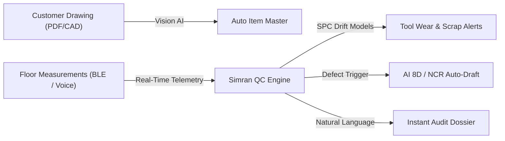

# Simran QC Platform — Demo Runbook & Landing Script

**Audience:** Simran Technocrats leadership + Quality Head
**Prepared by:** Skyrn Studio
**Purpose:** a self-contained script to demonstrate every feature, prove the maths, and close the pilot.

> How to use this document: review §2 (Excel vs. Platform contrast) & §3 (Feature inventory) once before the call.
> Run §4 the morning of. Follow §5 top to bottom while presenting — every number you type is listed,
> along with the expected result. Use §7 to discuss future AI automation opportunities, and §8 for the closing pitch.

---

## 1. Is the project done?

**Short answer: the product is functionally complete and demo-ready (Phases 1–8), but not yet formally accepted or shop-floor piloted.** That distinction matters — say it plainly and it builds credibility rather than costing it.

| Area                                      | Status           | Notes                                                                 |
| ----------------------------------------- | ---------------- | --------------------------------------------------------------------- |
| Auth, roles, MFA, inactivity timeout      | ✅ Done          | Admin-provisioned accounts (one per role), TOTP for QH/Admin          |
| Dimensional workflow (ST/QC/02)           | ✅ Done          | 53-row grid, 5 samples, autosave, offline, submit                     |
| Coating workflow (ST/QC/04)               | ✅ Done          | 5-section wizard, psychrometric lock-out, DFT, shelf-life             |
| Review & dual sign-off                    | ✅ Done          | Queue, flags, separation of duties, AAL2 server gate                  |
| Controlled reports (print/export)         | ✅ Code complete | **Pending:** golden-file fidelity sign-off on paper (client QH) |
| Item Master + Equipment Registry          | ✅ Done          | Editor, paste-import, calibration trail, usage recall                 |
| NCR + instrument audit recall             | ✅ Done          | Drafter, register, CSV recall                                         |
| Offline-first sync                        | ✅ Done          | Dexie drafts, queue drain on reconnect                                |
| Automated quality gate                    | ✅ Green         | `npm run verify` — typecheck + lint + **244 tests**          |
| Shop-floor pilot (1 week, zero data loss) | ⏳ Pending       | Phase 7 — this is the next milestone                                 |
| OEM mock audit (client runs it alone)     | ⏳ Pending       | Phase 9 — the acceptance event                                       |

**Landing line:** *"Everything you're about to see is built and tested. The only things left are two things only you can do — sign off the printed report format, and run it for a week on the floor."*

---

## 2. Manual Excel vs. Simran QC Platform — The Concrete Contrast

When pitching to leadership and the Quality Head, frame this not merely as "modern software replacing paper," but as **eliminating acute compliance liabilities discovered in their audited plant workbooks** (`Inspection Format.xlsx` ST/QC/02 and `Painting report.xlsx` for Flender/Winergy).

| Operational Dimension                           | Current Reality: Manual Excel Workbooks                                                                                                                                                                                                                                                                                                                                                                                                                                                                                                                                               | Simran QC Platform (What We Built)                                                                                                                                                                                          | Direct Business Impact                                                                                                                          |
| :---------------------------------------------- | :------------------------------------------------------------------------------------------------------------------------------------------------------------------------------------------------------------------------------------------------------------------------------------------------------------------------------------------------------------------------------------------------------------------------------------------------------------------------------------------------------------------------------------------------------------------------------------ | :-------------------------------------------------------------------------------------------------------------------------------------------------------------------------------------------------------------------------- | :---------------------------------------------------------------------------------------------------------------------------------------------- |
| **Inspection Throughput & Time**          | **45–60 minutes per batch.** Inspector writes readings on shop-floor paper notepads, walks to a desktop PC, and re-types 265 dimensional data points (53 rows × 5 samples) plus paint parameters.                                                                                                                                                                                                                                                                                                                                                                             | **Under 4 minutes per batch.** High-speed, 60 fps virtualized grid with keyboard-first numpad flow (`Tab` / `Enter`), clipboard paste-fill, and bulk instrument apply.                                            | **92% time reduction.** Shifts ~2.5 hours/day of clerical data re-entry back into physical inspection on the shop floor.                  |
| **Tolerance & GD&T Integrity**            | **Formula fragility & blind entry.** Hardcoded text workarounds (e.g. `(2065)` forcing `=2065-2` manual formulas); critical typos (Nominal `10` entered as `Min 1 / Max 3`). Zero visual warning while typing.                                                                                                                                                                                                                                                                                                                                                          | **Point-of-entry GD&T validation.** Real-time color evaluation: 🟢 **PASS**, 🟡 **WARN** (within 10% of limit), 🔴 **FAIL**. Server re-verifies math on submit—client cannot tamper with verdicts. | Prevents out-of-spec parts from being packed or discovered later at customer receiving.                                                         |
| **Coating Psychrometrics (ISO 12944-7)**  | **Manual math & false non-conformances.** Recorded dew points guessed or handwritten. **Audited failure:** Steel recorded at $28.8^\circ\text{C}$ with Dew Point at $29.2^\circ\text{C}$ ($T_{steel} < T_{dew}$, margin $-0.4^\circ\text{C}$)—an immediate batch rejection on paper despite safe ambient physics. | **Automated Magnus-Tetens Engine.** Calculates true psychrometric dew point ($T_{dew}$) from Ambient Temp & %RH in real-time. **Hard safety lock** enforces $T_{steel} - T_{dew} \ge 3.0^\circ\text{C}$ and $RH \le 85\%$. | **Zero risk of failing an ISO 12944 paint audit.** The software physically refuses to sign off a non-compliant paint coat.                                                                                            |                                                                                                                                                 |
| **DFT Statistics (ISO 19840 / SSPC-PA2)** | **26 hidden shadow columns.** Merged-cell limitations forced inspector to create off-screen helper cells (`AK24:BJ27`) to compute Min/Max/Avg. Manually checking 52 readings against 80/200 rules is tedious and prone to oversight.                                                                                                                                                                                                                                                                                                                                          | **Instant in-memory statistical engine.** Evaluates 26-point inside (240 µm) and outside (180 µm) grids; auto-computes Min, Max, Mean, $\sigma$, and exact ISO 19840 80/200 compliance in 50 ms.                  | Eliminates hidden spreadsheet corruption; delivers OEM-grade statistical film reports instantly.                                                |
| **Equipment & Calibration Traceability**  | **100% missing records.** Typing equipment IDs 53 times per sheet was too tedious, leaving the `EQUIPMENT ID` column blank. Zero mechanism to prevent using an expired micrometer or caliper.                                                                                                                                                                                                                                                                                                                                                                                 | **Centralized instrument registry.** Bulk-apply instruments to all rows in 1 tap. System detects calibration due dates; blocks submission or raises mandatory review flags on expired gauges.                         | **1-click audit recall.** An auditor asks "which batches used caliper VC-04?"; answer in 3 seconds instead of 4 days of binder searching. |
| **Cross-Stage Batch Continuity**          | **Data divergence between stages.** Surface Prep had batch `2604-02` while Final Inspection had `2605-02` because dates crossed into May, breaking lot reconciliation in audits.                                                                                                                                                                                                                                                                                                                                                                                            | **Unified relational lot entity.** Dimensional inspection, surface prep, coat logs, and DFT share a single immutable batch record. Linked coating batch created in 1 click without re-typing.                         | Airtight lot genealogy from raw substrate blast to final dispatch.                                                                              |
| **Accountability & Sign-Off Gating**      | **Unsigned, easily edited cells.** "Checked By" fields left blank or contain plain static text. Anyone with spreadsheet access can alter numbers after dispatch.                                                                                                                                                                                                                                                                                                                                                                                                                | **Cryptographic dual sign-off & MFA.** Strict separation of duties (authors cannot approve). Quality Head approval requires TOTP MFA (AAL2). Decisions are immutable with audit timestamps.                           | Absolute legal and customer defense during warranty or quality claims.                                                                          |
| **Shop-Floor Resilience**                 | **Vulnerable to network & file loss.** Corrupted `.xlsx` files, accidental formula deletion, multi-user file lock conflicts, lost local files.                                                                                                                                                                                                                                                                                                                                                                                                                                | **Offline-first Dexie (IndexedDB) engine.** Survives shop-floor Wi-Fi blackspots with zero data loss. Auto-syncs queue on reconnect; multi-tab conflict guard locks duplicate tabs read-only.                         | Zero lost keystrokes; works reliably anywhere on the factory floor.                                                                             |
| **Audit Preparation & Export**            | **Days of manual document assembly.** Pulling physical workbooks, scanning sheets, printing Excel grids with broken page margins, formatting inconsistencies.                                                                                                                                                                                                                                                                                                                                                                                                                   | **Deterministic print-CSS report engine.** One-click export of controlled **ST/QC/02** and **ST/QC/04** reports matching certified plant geometry. Audit trail logs every export.                         | Complete audit defense ready on demand during surprise OEM visits.                                                                              |

### The 3 Core Talking Points for Executive Leadership:

1. **Time Reclamation:** *"Your quality team spends nearly an hour per batch wrestling with spreadsheet formatting, copying gauge IDs, and manually calculating tolerances. We cut that to under 4 minutes, freeing your inspectors to actually inspect parts."*
2. **Defensible Compliance:** *"In your current Excel files, a simple transcription typo created a record stating you painted when steel was colder than dew point—an automatic ISO non-conformance. Our software runs the physics at the point of capture, making that humanly impossible."*
3. **Audit Immunity:** *"When Flender, Winergy, or Siemens asks for full calibration and inspection genealogy for an order shipped six months ago, you don't spend a week digging through paper binders. You filter and export a certified dossier in 5 seconds."*

---

## 3. Feature inventory — what to show, and the value it proves

Each row = one demo beat. The value column is what you say out loud.

| #  | Feature                                     | Screen                        | Value (the "so what")                                                                   |
| -- | ------------------------------------------- | ----------------------------- | --------------------------------------------------------------------------------------- |
| 1  | Provisioned accounts, one per role          | `/signup` (gate screen)     | Every account is issued by the admin with exactly one role — no self-service access    |
| 2  | Login + TOTP MFA (QH/Admin)                 | `/login`                    | Approvals are cryptographically gated — a stolen password can't approve a lot          |
| 3  | Dashboard KPI strip + drafts strip          | Dashboard                     | Answers "what needs me now?" in one screen; >24 h stale drafts flagged                  |
| 4  | Dual create actions + recent-items-first    | Dashboard → New dimensional  | The two workflows are first-class; repeat items are one tap                             |
| 5  | 53-row virtualised grid, 5 samples          | Batch grid                    | 265 data points, 60 fps, keyboard-only capable                                          |
| 6  | Live tolerance colouring (pass/warn/fail)   | Batch grid                    | Errors caught at the point of entry, not at review                                      |
| 7  | Min/Nom/Max printed on every row            | Batch grid                    | Inspector never pages to a drawing to know the band                                     |
| 8  | Paste-fill + keyboard navigation            | Batch grid / DFT              | A 5-sample row from one clipboard paste; numpad flow                                    |
| 9  | Bulk instrument apply + row progress        | Batch grid toolbar            | 53 instrument picks collapse to one; progress is visible                                |
| 10 | Autosave (saving/saved/offline)             | Batch grid header             | "Saved 12s ago" is the last*completed* write — no false reassurance                  |
| 11 | Offline capture + queue drain               | Batch grid (DevTools offline) | Shop-floor blackspots don't stop work; syncs on reconnect                               |
| 12 | Multi-tab conflict guard                    | Two tabs, one batch           | Second tab goes read-only — no silent last-write-wins                                  |
| 13 | Submission checklist gate                   | Batch grid                    | Cannot submit an incomplete or expired-instrument batch                                 |
| 14 | Psychrometric engine + ΔT lock-out         | Coating Section B             | ISO 12944 gate enforced by maths, not memory — prevents the documented non-conformance |
| 15 | Per-coat log + build-up stack               | Coating Section C             | Full paint traceability with the coat sequence visible                                  |
| 16 | Shelf-life hard block                       | Coating Section C             | Expired material physically cannot be signed off (COAT-04)                              |
| 17 | 26-point DFT grids + ISO 19840 verdict      | Coating Section D             | Mean/min/max/σ and 80/200 compliance with zero helper formulas                         |
| 18 | Visual defect checks (n-of-5)               | Coating Section E             | Structured defect capture feeding the NCR path                                          |
| 19 | Linked coating batch from dimensional lot   | Batch grid → Coating         | One lot, two records, no re-typing the header                                           |
| 20 | QH review queue with flag counts            | `/review`                   | QH triages by exception (▲ warns / ✕ fails / expired)                                 |
| 21 | Read-only record + separation of duties     | `/review/:id`               | The author never sees Approve/Reject; reviewer sees exactly what was submitted          |
| 22 | Approve / Reject with reasons               | `/review/:id`               | Rejection carries the "what and where" back to the inspector                            |
| 23 | Rejected pin + QH comments                  | Dashboard                     | The inspector sees*why* it came back, on the batch                                    |
| 24 | Controlled reports ST/QC/02 & ST/QC/04      | `/reports/:id`              | One click, audit-ready, matches the plant format                                        |
| 25 | Export audit trail                          | Reports                       | Every print/email is logged against the actor                                           |
| 26 | Item Master editor (new/edit, paste-import) | Admin → Items                | Templates maintained without a developer                                                |
| 27 | Equipment registry + calibration trail      | Admin → Instruments          | Per-gauge history; audit recall exports in one click                                    |
| 28 | NCR drafter + register                      | NCR                           | Non-conformances captured at the moment of failure                                      |
| 29 | Real-time approve/reject notification       | Dashboard                     | Inspector is told the moment a batch is decided — no refresh, no phone call            |

---

## 4. Pre-demo setup (run this the morning of)

The local Docker Supabase stack has been removed — the hosted **Simran Technocrats**
project is the single backend, and `.env.local` already points at it.

```bash
# 1. Data check (fixture batches + demo users live on hosted; re-seed if needed)
# seed check — re-apply supabase/seed.sql via the Supabase MCP (idempotent)

# 2. Start the app
npm run dev               # http://localhost:5173

# 3. Prove the gate is green (say this number out loud in the demo)
npm run verify            # typecheck + lint + 244 tests
```

**Browser hygiene between rehearsals** (clears local drafts so the demo starts clean):
DevTools → Application → Storage → **Clear site data**, then hard-reload.

**One-time prep — enrol the Quality Head's authenticator** (approval is AAL2-gated):

1. Sign in as `qh@simran.local`.
2. Tap **“▲ MFA enrollment required — set up now”** in the sidebar.
3. Scan the QR with Google Authenticator / Authy, enter the 6-digit code, confirm.
4. Sign out. From now on, QH login asks for the code — *this is a feature, show it.*

### Demo accounts

| Role           | Email                       | Password        | Used for                 |
| -------------- | --------------------------- | --------------- | ------------------------ |
| QC Inspector   | `inspector1@simran.local` | `Simran#2026` | Runs the inspection      |
| Quality Head   | `qh@simran.local`         | `Simran#2026` | Approves/rejects (TOTP)  |
| Admin          | `admin@simran.local`      | `Simran#2026` | Item Master, instruments |
| NACE Inspector | `nace@simran.local`       | `Simran#2026` | Coating authority        |

> **Hosted project note:** the hosted **Simran** project has email confirmation OFF and carries the same four demo accounts as the local seed (`Simran#2026`). Either backend works for the live demo. Self-service sign-up is disabled by design — accounts are provisioned in Supabase by the admin.

---

## 5. The demo script

Timing target: **22–26 minutes.** Bold = what you click/type. *Italic* = what you say.

### Act 0 — The problem, in their words (2 min)

*"Today a lot is measured by hand, written on a logsheet, then typed into a spreadsheet. Every transcription is a chance for one of the exact errors that already costs you — a dew point called safe when it wasn't, a nominal entered as Min 1 / Max 3. This platform moves the maths to the point of capture and keeps a defensible record."*

### Act 1 — Access with intent (1 min)

1. On **/login**, click **Need access?** → the gate screen explains the model.
   - *Say:* *"Nobody can self-register into a quality system. Every account is issued by the administrator with exactly one role — inspector, NACE authority, Quality Head, or admin. Least privilege by construction."*
2. Back to sign in; move straight to Act 2 (the roles are already on screen: four accounts, one per role).

### Act 2 — A dimensional inspection, live (8 min)

1. Sign in as **inspector1@simran.local / Simran#2026**.
2. Dashboard: point out the **KPI strip** (*In progress / Awaiting review / Returned / Approved*) and the **drafts strip**. *"This answers 'what needs me now' in one glance."*
3. Click **New dimensional**. Pick **W1G00005572** (Spiral Air Duct Cap · FLENDER).
4. Header — type these exact values:

   | Field           | Value              |
   | --------------- | ------------------ |
   | PO number       | `PO-DEMO-2609`   |
   | Delivery batch  | `2609-01`        |
   | Inspection date | today (pre-filled) |
   | Lot quantity    | `120`            |

   Click **Load Inspection Grid →**.
5. Point out: **53 rows**, columns **Sr. / Dimension / Min-Nom-Max / 01–05 / Instrument**, and the toolbar **“0/53 rows complete”**. *"Min, Nominal and Max are on every row — no drawing lookup."*
6. Type a **PASS / WARN / FAIL** demonstration on **row DIM-08** (nominal **100.00**, limits **99.50–100.50**):

   | Cell            | Type       | Expected chip                                      |
   | --------------- | ---------- | -------------------------------------------------- |
   | Row 8 sample 01 | `100.00` | **PASS** (green)                             |
   | Row 8 sample 02 | `100.45` | **NEAR** (amber — within 0.10 of the limit) |
   | Row 8 sample 03 | `100.60` | **FAIL** (red — above 100.50)               |

   *Say:* *"The verdict is instant and it's the same engine the server re-runs on submit — the client can't fake a pass."*
7. Keyboard/paste demo: click row 9 sample 01, paste **`100.25<TAB>`** pattern or use arrow keys across cells. *"An inspector can do the whole grid without a mouse."*
8. Fix sample 03 back to `100.10` (clears the FAIL) — *"corrections are free."*
9. Toolbar: **“Same instrument for every row?” → VC-04 — Mitutoyo 500-196-30**. *"53 instrument picks collapse to one."*
10. Point at the header save indicator: **“✓ saved …”**. *"Autosave is continuous; the timestamp only advances on a completed write."*
11. **Offline proof:** DevTools → Network → **Offline**. Type a value in row 10. Refresh (still offline is fine for Dexie; reconnect if your setup needs it). The value is still there. Go back **Online**.

    - *Say:* *"The floor has blackspots. Work doesn't stop and nothing is lost."*
12. Click **Submit for review**. If the checklist objects, show it, fix the cue it names, and submit. *"You cannot submit an incomplete or expired-instrument batch."*

### Act 3 — The coating record and the safety gate (7 min)

1. On the submitted batch, click **“Coating batch for this lot →”**. The header is **inherited** — *"one lot, two records, zero re-typing."*
2. **Section A — Surface prep:**
   - Steel grade: type **IS 2062 Gr. B**; Blast method: type **Airless Grit Blasting**.
   - Blast grade: type **Sa 2.5** (ISO 8501-1); Grit size: type **G-40**.
   - Select **Comparator grade → Medium (G)**.
   - Check all three pre-treatment verification checkmarks:
     - ☑ **Welds / edges dressed smooth (P-2)**
     - ☑ **Solvent clean per ISO 12944-4**
     - ☑ **Water break test — no beading**
   - Profile µm: type **60** → live chip **PASS (45–75 µm)** (green).
     - *Demo out-of-range:* type **35** → flips to **OUT OF RANGE (<45 µm)** (red). Reset to **60**.
   - Profile gauge: select **DG-01 — Elcometer 456**.
3. **Section B — Psychrometrics.** Two takes:
   - **Safe:** Ambient **25.0 °C**, RH **50 %**, Steel **30.0 °C** → dew point ≈ 13.9 °C, ΔT ≈ **16.1 °C** → **APPROVED** (green).
   - **Prohibited:** set RH **90 %** → the panel **locks**. *"ISO 12944 says above 85 % RH you do not paint. The software agrees, and it won't let you sign."*
   - *Demo Delta-T failure:* set Ambient **25.0 °C**, RH **70 %**, Steel **21.0 °C** → dew point ≈ 19.4 °C, ΔT ≈ **1.6 °C < 3 °C** → **PROHIBITED** (red).
   - Reset RH to **50 %** and Steel to **30.0 °C** to proceed.
4. **Section C — Coat log:** show the live build-up stack pills at top (Coat 1 / Coat 2 / Coat 3).
   - **Coat 1 (Primer):** Product **Interplus 256**, Part A batch **IPA-2609**, Part B **IPB-881**, mfg date **today**, Thinner **5 %**, WFT readings **110 / 115 / 110** → average **112 µm** (green).
   - **Coat 2 (Intermediate):** Product **Intergard 475HS**, Part A batch **IGA-2609**, Part B **IGB-475**, mfg date **today**, Thinner **5 %**, WFT readings **160 / 165 / 160** → average **162 µm** (green).
   - **Coat 3 (PU Finish):** Product **Interthane 990**, RAL **7035**, Part A batch **ITA-2609**, Part B **ITB-104**, mfg date **today** → shelf-life chip displays **VALID** (green).
     - *Shelf-life hard block demo:* change mfg date to **2024-01-01** → *"Shelf life expired”* hard block (red). *"Expired material physically cannot be signed onto a lot."*
     - Reset mfg date to **today** (clears the block).
     - Thinner: **10 %**, WFT readings **80 / 85 / 80** → average **82 µm** (green).
5. **Section D — DFT.** Nominal **240 µm** inside / **180 µm** outside.
   - Point out that **profile gauge DG-01** carries through from Section A automatically.
   - Type **240** across a few inside points → live **Mean/Min/Max/σ** and **ISO 19840 PASS**.
   - *80/200 rule demo:* type **150** in one inside point → **below the 80 % floor (192 µm)** → verdict flips to **FAIL**.
   - *Ceiling demo:* type **500** in one inside point → **above the 200 % cap (480 µm)** → verdict flips to **FAIL**.
   - Reset value to **240** (clears the fail).
6. **Section E — Visual checks:**
   - Walk through the 5 standardized defect criteria:
     1. Runs & sags → **Pass**
     2. Blistering → mark **Fail** → the **n-of-5** counter drops to **4/5**, warning banner appears, and the **Draft NCR** action lights up.
     3. Pinholes / Porosity → **Pass**
     4. Orange peel → **Pass**
     5. Dry spray / Overspray → **Pass**
   - Click **Draft NCR**: show the modal pre-filling batch ID, item code, and defect details automatically.
   - Reset Blistering back to **Pass** to clear the gate.
7. Submit the coating batch. Show the submission checklist ensuring all 5 sections are green.

### Act 4 — Quality Head review & dual sign-off (4 min)

1. Sign in as **qh@simran.local / Simran#2026** → enter the **TOTP code**.
   - *Say:* *"Approvals require a second factor, enforced server-side — not just in the UI."*
2. Open **Review queue**: show the **flag columns** (▲ warns / ✕ fails / expired instruments). *"Triage by exception."*
3. Open the dimensional batch. Point out:
   - the **read-only** record (exactly what the inspector submitted);
   - flag anchors jumping to the offending rows;
   - **Approve & Sign** / **Reject…** — and that the **author** would never see these buttons.
4. Click **Approve & Sign**. *"The batch is now immutable — a permanent record."*
5. (Optional) **Reject** a second batch with a comment, then sign back in as the inspector to show the **rejected pin with the QH's reason** on the dashboard.

### Act 5 — The audit-ready document (3 min)

1. Sign back in as the inspector; open the approved batch → **Export/Report**.
2. Show **ST/QC/02** rendering, then the coating **ST/QC/04**. *"One click, matches the plant format, and the layout is locked — it can't drift."*
3. Mention the **print guard**: only controlled documents print from the platform.

### Act 6 — Admin, NCR, and the audit trail (3 min)

1. As **admin**, open **Item Master**: show the editor and **paste-import** of dimensions. *"Templates are maintained without a developer."*
2. Open **Instruments**: show the **detail drawer** — calibration timeline + **usage recall**, and export the CSV. *"During an audit you can answer 'which lots did gauge VC-04 touch?' in one click."*
3. Open the **NCR register**: show the draft created from the visual fail, with a DB-allocated number (**NCR-2609-001**). *"Non-conformances are captured at the moment of failure, not reconstructed later."*
4. Close on **offline + sync** if not already shown.

---

## 6. Test-data cheat sheet (copy/paste)

**Item:** `W1G00005572` — Spiral Air Duct Cap · drawing `9423E` rev `A` · customer `FLENDER`

**Dimensional grid** — 53 rows; row *s* nominal = `100 + ((s-1) % 7) × 0.25`, tolerance `±0.5`

| Row    | Nominal | Min   | Max    | PASS       | WARN (within 0.10 of a limit) | FAIL       |
| ------ | ------- | ----- | ------ | ---------- | ----------------------------- | ---------- |
| DIM-08 | 100.00  | 99.50 | 100.50 | `100.00` | `100.45`                    | `100.60` |
| DIM-02 | 100.25  | 99.75 | 100.75 | `100.25` | `100.70`                    | `100.85` |

Row **DIM-01** is the **reference** dimension and is intentionally **locked**.

**Surface Preparation (Section A)**

| Field               | Demo Value                          | Acceptance Criteria / Verification       |
| ------------------- | ----------------------------------- | ---------------------------------------- |
| Steel grade         | `IS 2062 Gr. B`                     | Substrate specification                  |
| Blast method        | `Airless Grit Blasting`             | Mechanical abrasive cleaning             |
| Blast grade         | `Sa 2.5`                            | ISO 8501-1 near-white bare metal         |
| Grit size           | `G-40`                              | Angular chilled iron grit                |
| Comparator grade    | `Medium (G)`                        | ISO 8501-3 surface profile comparator    |
| Pre-treatment       | Welds (P-2) / Solvent / Water break | All 3 checkboxes checked                 |
| Surface profile µm  | `60`                                | Working band **45–75 µm** (green PASS)   |
| Profile fail demo   | `35`                                | Red chip **OUT OF RANGE (<45 µm)**       |
| Profile gauge       | `DG-01 — Elcometer 456`             | Verified in-calibration instrument       |

**Psychrometrics (Section B)**

| Scenario     | Ambient  | RH   | Steel    | Result                          |
| ------------ | -------- | ---- | -------- | ------------------------------- |
| Safe         | 25.0 °C | 50 % | 30.0 °C | APPROVED (ΔT ≈ 16.1 °C ≥ 3) |
| RH lock-out  | 25.0 °C | 90 % | 30.0 °C | PROHIBITED (RH > 85 %)          |
| ΔT lock-out | 25.0 °C | 70 % | 21.0 °C | PROHIBITED (ΔT ≈ 1.6 °C < 3) |

**Coat Log (Section C)**

| Coat | Layer Name        | Product Name       | Shade / RAL | Part A Batch | Part B Batch | Mfg Date   | Shelf-Life | Thinner % | WFT Readings (µm) | Avg WFT |
| ---- | ----------------- | ------------------ | ----------- | ------------ | ------------ | ---------- | ---------- | --------- | ----------------- | ------- |
| 1    | Primer Coat       | `Interplus 256`    | Aluminium   | `IPA-2609`   | `IPB-881`    | Today      | **VALID**  | 5 %       | `110, 115, 110`   | 112 µm  |
| 2    | Intermediate Coat | `Intergard 475HS`  | Grey        | `IGA-2609`   | `IGB-475`    | Today      | **VALID**  | 5 %       | `160, 165, 160`   | 162 µm  |
| 3    | PU Finish Coat    | `Interthane 990`   | `RAL 7035`  | `ITA-2609`   | `ITB-104`    | Today      | **VALID**  | 10 %      | `80, 85, 80`      | 82 µm   |
| —    | **Expired Demo**  | `Interthane 990`   | `RAL 7035`  | `ITA-2609`   | `ITB-104`    | 2024-01-01 | **EXPIRED**| —         | —                 | Blocked |

**DFT (Section D)** — inside nominal **240 µm** (80 % floor = 192, 200 % cap = 480); outside nominal **180 µm** (floor 144, cap 360)

| Side    | PASS    | FAIL (below 80 %) | FAIL (above 200 %) |
| ------- | ------- | ----------------- | ------------------ |
| Inside  | `240` | `150`           | `500`            |
| Outside | `180` | `120`           | `380`            |

**Visual Checks (Section E)**

| Inspection Item         | Standard Result | Demo Trigger / Action                                       |
| ----------------------- | --------------- | ----------------------------------------------------------- |
| Runs & sags             | Pass            | Visual barrier verification                                 |
| Blistering (ASTM D714)  | Fail (Demo)     | Flips score to **4/5**, lights up **Draft NCR** flow        |
| Pinholes / Porosity     | Pass            | High-voltage sponge / visual check                          |
| Orange peel             | Pass            | Surface levelling verification                              |
| Dry spray / Overspray   | Pass            | Adhesion barrier verification                               |

**Instruments:** `VC-04` calliper · `MC-02` micrometer · `DG-01` DFT gauge · `HG-01` hygrometer · `PG-01` surface thermometer.
To demo **expiry**, use Admin → Instruments to set a gauge's last-calibration date to **2024-01-01** (12-month interval) → status **EXPIRED**; selecting it on a reading raises the EQ-03 flag + mandatory acknowledgement at review.

**Certificate / lot values:** PO `PO-DEMO-2609`, delivery batch `2609-01`, lot qty `120`, product `Interthane 990`, RAL `7035`.

---

## 7. Future horizons — AI automations & intelligent quality roadmap

Use this section to outline how the Simran QC Platform evolves from a **digital inspection system** into an **autonomous quality intelligence engine**. These initiatives represent high-margin expansion opportunities for future development phases.



### 1. 📐 Blueprint Vision: AI Engineering Drawing Ingestion (CAD/PDF to Item Master)

- **The Friction:** Onboarding a new customer component (e.g., Flender Spiral Air Duct Cap `W1G00005572` or custom blower housings) requires manually transcribing 50+ dimensions, nominals, upper/lower tolerances, and GD&T symbols into the system—taking 45–60 minutes per item.
- **AI Automation:** A multi-modal Vision AI pipeline ingests 2D engineering drawings (PDF, DWG, or TIFF). It parses dimension callouts, standard tolerance tables (ISO 2768-mK), and feature control frames, automatically generating a draft Item Master template.
- **Human-in-the-Loop:** Displays a split-screen side-by-side verification diff for the Quality Head to review and approve in under 90 seconds.
- **Value to Simran:** Dramatically accelerates RFQ-to-production turnaround for new OEM contracts.

### 2. 📈 Predictive Process Drift & Tool Wear Intelligence (AI-SPC)

- **The Friction:** Stamping dies, deep-drawing tools, and CNC cutting inserts wear down gradually over time. Today, Simran Technocrats only discovers tool degradation when a batch fails final inspection, resulting in costly scrap or urgent rework.
- **AI Automation:** Statistical Process Control (SPC) machine learning models analyze dimensional trends across the last 20–100 consecutive batches. The AI identifies systematic micro-drifts (e.g., *Dimension DIM-08 creeping +0.012 mm every 5 batches towards the upper limit*).
- **Actionable Insight:** Delivers proactive toolroom alerts: *"Tooling for DIM-08 is within 15% of upper tolerance threshold. Recommend die regrind or insert replacement before Batch #2610."*
- **Value to Simran:** Prevents batch scrap before it happens; transforms reactive quality control into predictive quality assurance.

### 3. 📑 Automated NCR Root-Cause & 8D Synthesis

- **The Friction:** When a part or coating reading fails, drafting Non-Conformance Reports (NCR) and 8D customer defense documents is delayed, administratively painful, and often lacks deep statistical correlation.
- **AI Automation:** The moment an inspector flags an NCR or a reading fails hard, an AI reasoning agent synthesizes:
  - The failing parameter and delta from nominal;
  - Correlated production variables (ambient temperature, humidity, machine ID, raw material heat/coil number, operator ID);
  - Historical NCR resolution records from past similar incidents.
- **Output:** Auto-drafts 5-Why analysis, Ishikawa (Fishbone) categorizations (Machine, Method, Material, Man), and recommended Corrective & Preventive Actions (CAPA) ready for Quality Head sign-off.
- **Value to Simran:** Reduces 8D response time to Tier-1 OEMs from 5 days to 2 hours with audit-grade rigor.

### 4. 🎙️ Hands-Free Voice Capture & Direct Bluetooth Gauge Telemetry

- **The Friction:** On the shop floor, technicians measuring large or heavy weldments with both hands must repeatedly put down tools, walk over to a computer, and type readings.
- **AI Automation:**
  - **Industrial Voice Assistant:** Noise-resilient, shop-floor tuned acoustic model allows hands-free numeric dictation (*"Row eight, sample two: one zero zero point four five"*).
  - **Bluetooth Low Energy (BLE) Gauge Integration:** Direct wireless telemetry connecting digital calipers and micrometers (e.g. Mitutoyo U-WAVE / Sylvac). Clicking the button on the caliper instantly streams the reading into the active cell with 0 manual typing.
- **Value to Simran:** Cuts physical measurement logging time by an additional 60% and eliminates keyboard contamination in grimy plant environments.

### 5. 👁️ Computer Vision Surface Defect & Coating Anomaly Classifier

- **The Friction:** Section E visual inspection (runs, sags, blisters, pinholes, orange peel, overspray) is currently subjective, relying entirely on the visual acuity and judgment of individual operators.
- **AI Automation:** Tablet camera capture of the blasted substrate and cured coating. An edge computer vision model, pre-trained on ISO 8501-1 (surface cleanliness) and ASTM D714 (blistering standards), scans the surface photo, detects anomalies, and assigns an objective defect severity score.
- **Value to Simran:** Standardizes visual coating quality across shifts and protects against subjective rejection claims by customer receiving inspectors.

### 6. 💬 Conversational OEM Audit Defense Agent

- **The Friction:** When Flender, Siemens, or ISO auditors arrive for on-site surveillance audits, answering complex impromptu queries (*"Show every batch shipped under PO-4400 with coating applied when RH was above 75%, and identify which gauge verified them"*) triggers hours of stressful spreadsheet hunting.
- **AI Automation:** A natural language retrieval agent over the historical database. The Quality Head speaks or types the auditor's question in plain English and receives an authenticated, tamper-evident audit dossier with supporting calibration certificates in under 5 seconds.
- **Value to Simran:** Projects an image of absolute technological sophistication that instills supreme confidence in Tier-1 OEM auditors.

---

## 8. Landing script (the close)

Deliver this in this order — capability, then proof, then the ask.

> *"What you've just seen replaces a paper-and-clipboard loop with a defensible digital one. Three things matter to you specifically:*
>
> *One — **the maths runs at the point of capture.** Tolerance bands, dew point and ΔT, ISO 19840 DFT statistics — all computed instantly, then independently re-run on the server so a client can never fake a result.*
>
> *Two — **the record is audit-ready by construction.** Dual sign-off, immutable approvals, an export audit trail, and per-gauge usage recall. When an OEM auditor asks, you answer in one click instead of one week.*
>
> *Three — **it survives your floor.** It works in a blackspot, it holds drafts for days, and it doesn't lose a keystroke.*
>
> *It's built and tested — 244 automated tests are green. Two milestones remain, and both are yours: sign off the printed report format, and run it for a week on the floor. I'd like to book the format sign-off this week so we can start the pilot on [date]."*

**Objection handling**

- *"Can the inspector just approve their own batch?"* → No. Separation of duties is enforced on the server, and the author never sees the buttons.
- *"What if the network drops mid-inspection?"* → Better than paper — the draft persists locally and drains on reconnect.
- *"Will it print like our current format?"* → The layouts are locked to ST/QC/02 and ST/QC/04; that's exactly what the format sign-off confirms.
- *"How fast is it?"* → Initial load ≈ **218 KB gzip** (main bundle), split across **36 route chunks**; the grid evaluates a keystroke in a few milliseconds — the rendering is virtualised to hold 60 fps across 53 rows.

---

## 9. Reset between demos

```bash
# re-apply supabase/seed.sql via the Supabase MCP (idempotent)
```

In the browser: DevTools → Application → **Clear site data** → reload. This removes leftover local drafts so the next run starts from zero.

---

## 10. Appendix — engine thresholds (so you can defend any number)

| Rule                                  | Threshold                                                                  | Source                          |
| ------------------------------------- | -------------------------------------------------------------------------- | ------------------------------- |
| Dimension pass/warn/fail              | fail outside ±tol;**warn within 10 % of either limit**              | `domain/measurement.ts`       |
| DFT compliance (ISO 19840 / SSPC-PA2) | fail below**0.8 ×** nominal or above **2.0 ×** nominal       | `domain/dft-stats.ts`         |
| Coating application gate (ISO 12944)  | locked when**ΔT < 3.0 °C** or **RH > 85 %**                  | `domain/coating.ts`           |
| Dew point                             | Magnus–Tetens from ambient temp + RH                                      | `domain/dew-point.ts`         |
| Instrument status                     | **EXPIRED** at due date; **DUE_SOON** within **15 days** | `domain/instrument-status.ts` |
| Shelf life                            | expired when mfg date + interval is in the past —**hard block**     | `domain/coating.ts`           |
